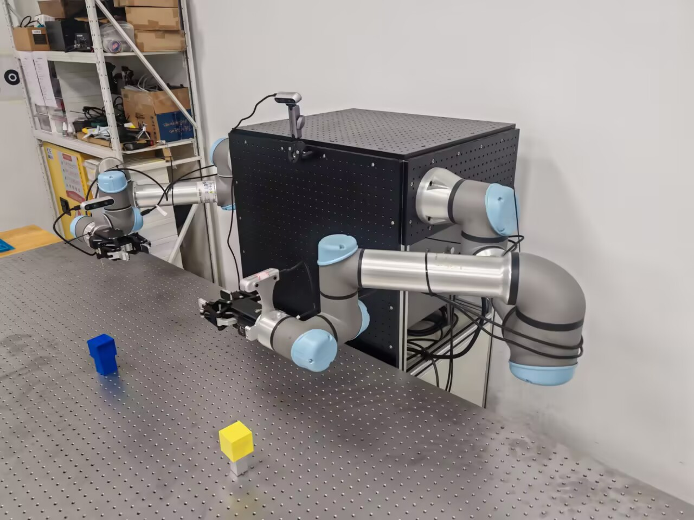
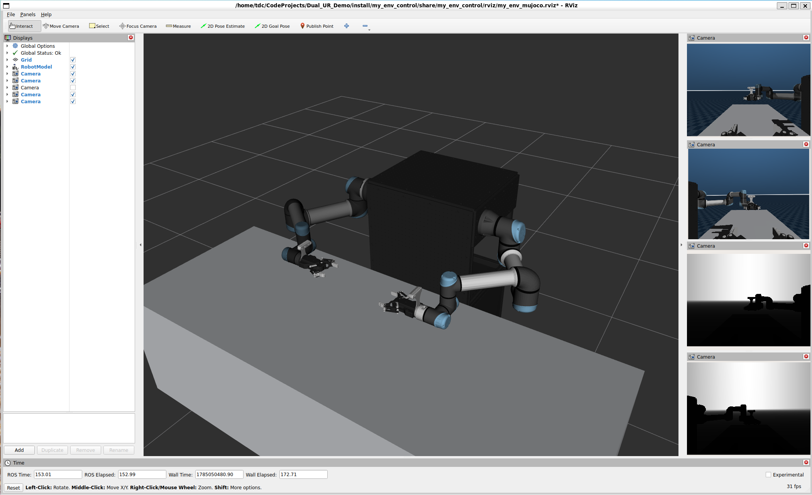
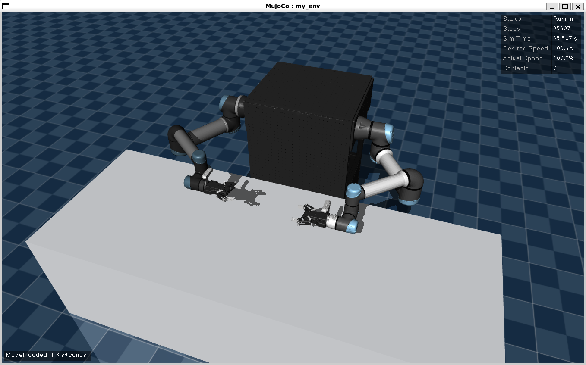

# 双臂UR机械臂ROS2控制系统

> **注意：本项目仅在 ROS2 Jazzy 上进行测试。**

这是一个基于ROS2的双臂UR机械臂控制系统，集成了UR5和UR5e机械臂、Robotiq 2F-85夹爪/DH-AG95夹爪 和RealSense D435相机，目前支持rviz仿真、真实机械臂控制，包含 MoveIt 规划、MoveIt Servo 笛卡尔/关节空间伺服控制。


<table>
  <tr>
    <td ><center>my_env_rviz </center></td>
    <td ><center>my_env_real </center></td>
  </tr>

  <tr>
    <td><center>my_env_mujoco_rviz </center></td>
    <td ><center>my_env_mujoco </center> </td>
  </tr>
</table>


## 开始

ROS2 换清华源: [清华大学开源软件镜像站 ROS2 软件仓库](https://mirror.tuna.tsinghua.edu.cn/help/ros2/)


安装依赖：

```bash
git clone https://github.com/TDC-TangChaoBanLi/Dual_UR_Demo.git
cd Dual_UR_Demo
git submodule update --init --recursive

sudo apt install ros-${ROS_DISTRO}-ros2-control ros-${ROS_DISTRO}-ros2-controllers -y
sudo apt install ros-${ROS_DISTRO}-moveit ros-${ROS_DISTRO}-moveit-ros-control-interface -y
sudo apt-get install ros-${ROS_DISTRO}-ur -y
sudo apt install ros-${ROS_DISTRO}-librealsense2* -y
sudo apt install ros-${ROS_DISTRO}-realsense2-* -y
```

测试： (robot_ip 为机械臂IP地址, reverse_ip 为本机地址)

```bash
ros2 launch ur_robot_driver ur_control.launch.py ur_type:=ur5 robot_ip:=192.168.1.17 reverse_ip:=192.168.1.100
ros2 launch ur_robot_driver ur_control.launch.py ur_type:=ur5e robot_ip:=192.168.1.11 reverse_ip:=192.168.1.100
```

编译本项目：

```bash
# sudo apt install colcon -y
# colcon build --symlink-install --packages-select robotiq_driver robotiq_controllers robotiq_description
colcon build --symlink-install --packages-select dh_ag95_description dh_ag95_controllers
colcon build --symlink-install --packages-select my_env_description my_env_moveit_config my_env_control
colcon build --symlink-install --packages-select my_env_mujoco
colcon build --symlink-install --packages-select my_control_demo
```

提取机械臂校准文件：

```bash
source install/setup.bash
ros2 launch ur_calibration calibration_correction.launch.py robot_ip:=192.168.1.17 target_filename:="src/my_env/my_env_control/config/ur_A_kinematics_calibration.yaml"
ros2 launch ur_calibration calibration_correction.launch.py robot_ip:=192.168.1.11 target_filename:="src/my_env/my_env_control/config/ur_B_kinematics_calibration.yaml"
```

打开 CAN0 接口：

```bash
sudo ip link set can0 down
sudo ip link set can0 type can bitrate 500000
sudo ip link set can0 up
```

启动机械臂 dashboard_client：

```bash
source install/setup.bash
ros2 launch my_env_control start_dual_ur_dashboard_client.launch.py
```

使用 dashboard_client 启动机械臂：

```bash
source install/setup.bash
ros2 service call /arm_A/dashboard_client/load_program ur_dashboard_msgs/srv/Load "{filename: 'TDC-ROS2.urp'}" # 加载机器人上的程序
ros2 service call /arm_B/dashboard_client/load_program ur_dashboard_msgs/srv/Load "{filename: 'TDC-ROS2.urp'}" # 加载机器人上的程序

ros2 service call /arm_A/dashboard_client/power_on std_srvs/srv/Trigger {} # 给机器人电机上电，上电后还需要释放刹车
ros2 service call /arm_A/dashboard_client/brake_release std_srvs/srv/Trigger {} # 释放刹车
ros2 service call /arm_B/dashboard_client/power_on std_srvs/srv/Trigger {} # 给机器人电机上电，上电后还需要释放刹车
ros2 service call /arm_B/dashboard_client/brake_release std_srvs/srv/Trigger {} # 释放刹车
```


启动机械臂 ros_control

```bash
source install/setup.bash
ros2 launch my_env_control start_my_env_control.launch.py use_fake_hardware:=false launch_rviz:=false
```

启动机械臂程序：
```bash
source install/setup.bash

ros2 service call /arm_A/dashboard_client/play std_srvs/srv/Trigger {} # 启动已加载的程序
ros2 service call /arm_B/dashboard_client/play std_srvs/srv/Trigger {} # 启动已加载的程序

ros2 service call /arm_A/dashboard_client/program_running ur_dashboard_msgs/srv/IsProgramRunning {} # 查询当前是否有程序正在运行
ros2 service call /arm_B/dashboard_client/program_running ur_dashboard_msgs/srv/IsProgramRunning {} # 查询当前是否有程序正在运行
```


启动 MoveIt move_group：

```bash
source install/setup.bash

# 切换控制器
ros2 control switch_controllers --deactivate arm_A_ur_forward_position_controller --activate arm_A_ur_scaled_joint_trajectory_controller
ros2 control switch_controllers --deactivate arm_B_ur_forward_position_controller --activate arm_B_ur_scaled_joint_trajectory_controller

# 启动 move_group
ros2 launch my_env_moveit_config start_my_env_moveit.launch.py launch_rviz:=true
```

启动 MoveIt servo：

```bash
source install/setup.bash
# 切换控制器
ros2 control switch_controllers --deactivate arm_A_ur_scaled_joint_trajectory_controller --activate arm_A_ur_forward_position_controller
ros2 control switch_controllers --deactivate arm_B_ur_scaled_joint_trajectory_controller --activate arm_B_ur_forward_position_controller

# 启动 servo
ros2 launch my_env_moveit_config start_my_env_servo.launch.py
```

设置 Servo 模式：

```bash
source install/setup.bash
# 设置 servo 模式为 position :
ros2 service call /arm_A_servo_node/switch_command_type moveit_msgs/srv/ServoCommandType "{command_type: 2}"
ros2 service call /arm_B_servo_node/switch_command_type moveit_msgs/srv/ServoCommandType "{command_type: 2}"
# 设置 servo 模式为 twist :
# ros2 service call /arm_A_servo_node/switch_command_type moveit_msgs/srv/ServoCommandType "{command_type: 1}"
# ros2 service call /arm_B_servo_node/switch_command_type moveit_msgs/srv/ServoCommandType "{command_type: 1}"
# 设置 servo 模式为 joint :
# ros2 service call /arm_A_servo_node/switch_command_type moveit_msgs/srv/ServoCommandType "{command_type: 0}"
# ros2 service call /arm_B_servo_node/switch_command_type moveit_msgs/srv/ServoCommandType "{command_type: 0}"
```


关闭机械臂电机：

```bash
source install/setup.bash

ros2 service call /arm_A/dashboard_client/power_off std_srvs/srv/Trigger {}  # 关闭机器人电机

ros2 service call /arm_B/dashboard_client/power_off std_srvs/srv/Trigger {}  # 关闭机器人电机
```


关闭机械臂控制柜：

```bash
ros2 service call /arm_A/dashboard_client/shutdown std_srvs/srv/Trigger {} # 关闭机器人控制柜
ros2 service call /arm_B/dashboard_client/shutdown std_srvs/srv/Trigger {} # 关闭机器人控制柜
```


RealSense 权限：

```bash
sudo usermod -aG video $USER # 把当前用户加入 video 组
sudo reboot # 重启
groups # 查看权限组，应该有 video
```

RealSense 启动：

```bash
lsusb -t # 查看所有USB设备，确保 uvcvideo 设备的速度大于 500 Mbps
rs-enumerate-devices -s # 查看 RealSense 相机序列号 (Serial Number)
```

```bash
# 单独启动 arm_A 相机节点
ros2 launch realsense2_camera rs_launch.py \
  serial_no:=_401522071845 \
  camera_name:=arm_A \
  enable_depth:=true \
  enable_color:=true \
  depth_module.depth_profile:=640x480x30 \
  rgb_camera.color_profile:=640x480x30 \
  align_depth.enable:=true \
  pointcloud.enable:=true \
  spatial_filter.enable:=true \
  temporal_filter.enable:=true

# 单独启动 arm_B 相机节点
ros2 launch realsense2_camera rs_launch.py \
  serial_no:=_335222076295 \
  camera_name:=arm_B \
  enable_depth:=true \
  enable_color:=true \
  depth_module.depth_profile:=640x480x30 \
  rgb_camera.color_profile:=640x480x30 \
  align_depth.enable:=true \
  pointcloud.enable:=true \
  spatial_filter.enable:=true \
  temporal_filter.enable:=true

# 启动多相机节点
ros2 launch realsense2_camera rs_multi_camera_launch.py \
  serial_no1:=_401522071845 \
  serial_no2:=_335222076295 \
  camera_name1:=arm_A \
  camera_name2:=arm_B \
  camera_namespace1:=camera \
  camera_namespace2:=camera \
  base_frame_id1:=realsense_link \
  base_frame_id2:=realsense_link \
  enable_depth1:=true \
  enable_depth2:=true \
  enable_color1:=true \
  enable_color2:=true \
  depth_module.depth_profile1:=640x480x30 \
  depth_module.depth_profile2:=640x480x30 \
  rgb_camera.color_profile1:=640x480x30 \
  rgb_camera.color_profile2:=640x480x30 \
  align_depth.enable1:=true \
  align_depth.enable2:=true \
  pointcloud.enable1:=false \
  pointcloud.enable2:=false \
  spatial_filter.enable1:=true \
  spatial_filter.enable2:=true \
  temporal_filter.enable1:=true \
  temporal_filter.enable2:=true

ros2 launch realsense2_camera rs_multi_camera_launch.py \
  serial_no:=_115222071006 \
  camera_name:=global \
  camera_namespace:=camera \
  enable_depth:=true \
  enable_color:=true \
  depth_module.depth_profile:=640x480x30 \
  rgb_camera.color_profile:=640x480x30 \
  align_depth.enable:=true \
  pointcloud.enable:=false \
  spatial_filter.enable:=true \
  temporal_filter.enable:=true \
  unite_imu_method:=false
```

OCS2 适配：

下载 deb 包（按顺序安装，`ocs2_ros2` 为 OCS2 核心依赖，需先安装）：
- [ocs2_ros2 (legubiao)](https://github.com/legubiao/ocs2_ros2/releases/latest)
- [robot-descriptions-common](https://github.com/fiveages-sim/robot-descriptions-common/releases/latest)
- [arms_ros2_control](https://github.com/fiveages-sim/arms_ros2_control/releases/latest)

安装 deb 包及其依赖：
```bash
# 1. OCS2 核心库（ocs2_core / ocs2_mpc / ocs2_ros_interfaces 等）
sudo dpkg -i ros-jazzy-ocs2-ros2_*.deb

# 2. 机器人描述公共库（被 arms_ros2_control 依赖）
sudo dpkg -i ros-jazzy-robot-descriptions-common_*.deb

# 3. 双臂控制栈（ocs2_arm_controller / adaptive_gripper_controller /
#    arms_target_manager / arms_rviz_control_plugin 等）
sudo dpkg -i ros-jazzy-arms-ros2-control_*.deb

# sudo apt --fix-broken install # 若缺少依赖，先修复再重试
```

> 说明：`arms_ros2_control` 提供了本项目的 OCS2 双臂控制器（`ocs2_arm_controller`）、自适应夹爪控制器（`adaptive_gripper_controller`）、目标管理器（`arms_target_manager`，发布 RViz Interactive Markers）以及 RViz 插件（`arms_rviz_control_plugin`，GripperControlPanel / OCS2FSMPanel / JointControlPanel）。


## OCS2 控制启动

> 前置：已完成上述 OCS2 deb 安装，并编译本项目。

### 1. 无硬件 / 真实硬件模式（ros2_control）

```bash
source install/setup.bash

# 仿真（默认 use_fake_hardware:=true，无需连接真实机械臂）
ros2 launch my_env_control start_my_env_ocs2.launch.py

# 真实硬件（需先启动 dashboard_client 并 power_on / brake_release）
ros2 launch my_env_control start_my_env_ocs2.launch.py use_fake_hardware:=false
```

常用参数：
| 参数 | 默认值 | 说明 |
|---|---|---|
| `use_fake_hardware` | `true` | 使用 mock 硬件（命令镜像到状态，无需真机） |
| `ur_headless_mode` | `false` | UR 驱动 headless 模式 |
| `launch_rviz` | `true` | 是否启动 RViz |
| `use_sim_time` | `false` | 同步仿真时钟（MuJoCo 场景由专用 launch 管理） |

### 2. MuJoCo 仿真模式（mujoco_ros2_control）

```bash
source install/setup.bash

# 启动 MuJoCo 仿真 + OCS2 控制器 + RViz（带 MuJoCo 视窗）
ros2 launch my_env_mujoco start_my_env_mujoco_ocs2.launch.py

# 无头模式（不弹 MuJoCo 视窗，可配合 RViz 使用）
ros2 launch my_env_mujoco start_my_env_mujoco_ocs2.launch.py mujoco_headless:=true
```

常用参数：
| 参数 | 默认值 | 说明 |
|---|---|---|
| `mujoco_headless` | `false` | 是否隐藏 MuJoCo Simulate 视窗 |
| `mujoco_sim_speed_factor` | `1.0` | 仿真速度倍率（1.0 = 实时） |
| `launch_rviz` | `true` | 是否启动 RViz |

### 3. 操作方式

启动后在 RViz 中：
- **拖动 marker**：`Left Arm Target`（左臂 / arm_B）与 `Right Arm Target`（右臂 / arm_A）为 6-DOF Interactive Marker，可拖拽设定双臂末端目标位姿（`arms_target_manager` 会将其发布到 OCS2 控制器）
- **FSM 面板**（OCS2FSMPanel）：切换 `HOME → HOLD → OCS2` 状态，进入 OCS2 后机械臂会向 marker 目标运动
- **夹爪面板**（GripperControlPanel）：左右夹爪的开/关按钮与位置（0~1）控制，分别对应 `left/right_adaptive_gripper_controller`


## MuJoCo 仿真

MuJoCo 仿真基于 [mujoco_ros2_control](https://github.com/ros-controls/mujoco_ros2_control)，将 MuJoCo 作为 ros2_control 硬件接口运行物理仿真。

### 生成仿真资源

首次使用（或修改 URDF 后）需重新生成仿真模型：

```bash
# 1. 从 xacro 生成 urdf
xacro src/my_env/my_env_mujoco/urdf/my_env_mujoco.urdf.xacro -o src/my_env/my_env_mujoco/urdf/my_env_mujoco.urdf

# 2. 用 urdf2mjcf 转换为 MuJoCo XML（需先安装 urdf2mjcf）
source ~/CodeProjects/urdf2mjcf/.venv/bin/activate
urdf2mjcf src/my_env/my_env_mujoco/urdf/my_env_mujoco.urdf \
  -o src/my_env/my_env_mujoco/mjcf/my_env_mujoco.xml \
  -m src/my_env/my_env_mujoco/meshes \
  -j src/my_env/my_env_mujoco/config/my_env_config.json -c

# 3. 编译
colcon build --symlink-install --packages-select my_env_mujoco
```

### 启动仿真

```bash
source install/setup.bash

# 普通 ros2_control 控制（forward_position / joint_trajectory 等仿真控制器）
ros2 launch my_env_mujoco start_my_env_mujoco.launch.py

# OCS2 控制（见上方「OCS2 控制启动」第 2 节）
ros2 launch my_env_mujoco start_my_env_mujoco_ocs2.launch.py
```

仿真演示（预置动作循环）：

```bash
source install/setup.bash
ros2 run my_control_demo my_env_mujoco_control
```

