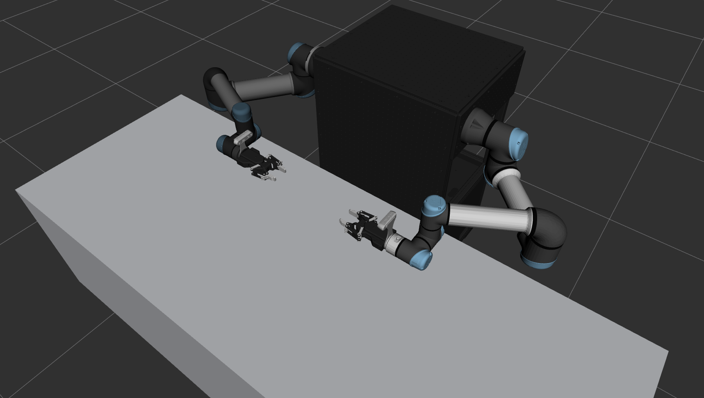

# 双臂UR机械臂ROS2控制系统

> **注意：本项目仅在 ROS2 Jazzy 上进行测试。**

这是一个基于ROS2的双臂UR机械臂控制系统，集成了UR5和UR5e机械臂、Robotiq 2F-85夹爪/DH-AG95夹爪 和RealSense D435相机，目前支持rviz仿真、真实机械臂控制，包含 MoveIt 规划、MoveIt Servo 笛卡尔/关节空间伺服控制。





## 开始

ROS2 换清华源: [清华大学开源软件镜像站 ROS2 软件仓库](https://mirror.tuna.tsinghua.edu.cn/help/ros2/)


安装依赖：

```bash
git clone https://github.com/TDC-TangChaoBanLi/Dual_UR_Demo.git
cd Dual_UR_Demo
git submodule update --init --recursive

sudo apt install ros-${ROS_DISTRO}-ros2-control ros-${ROS_DISTRO}-ros2-controllers -y
sudo apt install ros-${ROS_DISTRO}-moveit ros-${ROS_DISTRO}-moveit-ros-control-interface -y
sudo apt-get install ros-${ROS_DISTRO}-ur -y
sudo apt install ros-${ROS_DISTRO}-librealsense2* -y
sudo apt install ros-${ROS_DISTRO}-realsense2-* -y
```

测试： (robot_ip 为机械臂IP地址, reverse_ip 为本机地址)

```bash
ros2 launch ur_robot_driver ur_control.launch.py ur_type:=ur5 robot_ip:=192.168.1.17 reverse_ip:=192.168.1.100
ros2 launch ur_robot_driver ur_control.launch.py ur_type:=ur5e robot_ip:=192.168.1.11 reverse_ip:=192.168.1.100
```

编译本项目：

```bash
# sudo apt install colcon -y
# colcon build --symlink-install --packages-select robotiq_driver robotiq_controllers robotiq_description
colcon build --symlink-install --packages-select dh_ag95_description dh_ag95_controllers
colcon build --symlink-install --packages-select my_env_description my_env_moveit_config my_env_control
colcon build --symlink-install --packages-select my_control_demo
```

提取机械臂校准文件：

```bash
source install/setup.bash
ros2 launch ur_calibration calibration_correction.launch.py robot_ip:=192.168.1.17 target_filename:="src/my_env/my_env_control/config/ur_A_kinematics_calibration.yaml"
ros2 launch ur_calibration calibration_correction.launch.py robot_ip:=192.168.1.11 target_filename:="src/my_env/my_env_control/config/ur_B_kinematics_calibration.yaml"
```

打开 CAN0 接口：

```bash
sudo ip link set can0 down
sudo ip link set can0 type can bitrate 500000
sudo ip link set can0 up
```

启动机械臂 dashboard_client：

```bash
source install/setup.bash
ros2 launch my_env_control start_dual_ur_dashboard_client.launch.py
```

使用 dashboard_client 启动机械臂：

```bash
source install/setup.bash
ros2 service call /arm_A/dashboard_client/load_program ur_dashboard_msgs/srv/Load "{filename: 'TDC-ROS2.urp'}" # 加载机器人上的程序
ros2 service call /arm_B/dashboard_client/load_program ur_dashboard_msgs/srv/Load "{filename: 'TDC-ROS2.urp'}" # 加载机器人上的程序

ros2 service call /arm_A/dashboard_client/power_on std_srvs/srv/Trigger {} # 给机器人电机上电，上电后还需要释放刹车
ros2 service call /arm_A/dashboard_client/brake_release std_srvs/srv/Trigger {} # 释放刹车
ros2 service call /arm_B/dashboard_client/power_on std_srvs/srv/Trigger {} # 给机器人电机上电，上电后还需要释放刹车
ros2 service call /arm_B/dashboard_client/brake_release std_srvs/srv/Trigger {} # 释放刹车
```


启动机械臂 ros_control

```bash
source install/setup.bash
ros2 launch my_env_control start_my_env_control.launch.py use_fake_hardware:=false launch_rviz:=false
```

启动机械臂程序：
```bash
source install/setup.bash

ros2 service call /arm_A/dashboard_client/play std_srvs/srv/Trigger {} # 启动已加载的程序
ros2 service call /arm_B/dashboard_client/play std_srvs/srv/Trigger {} # 启动已加载的程序

ros2 service call /arm_A/dashboard_client/program_running ur_dashboard_msgs/srv/IsProgramRunning {} # 查询当前是否有程序正在运行
ros2 service call /arm_B/dashboard_client/program_running ur_dashboard_msgs/srv/IsProgramRunning {} # 查询当前是否有程序正在运行
```


启动 MoveIt move_group：

```bash
source install/setup.bash

# 切换控制器
ros2 control switch_controllers --deactivate arm_A_ur_forward_position_controller --activate arm_A_ur_scaled_joint_trajectory_controller
ros2 control switch_controllers --deactivate arm_B_ur_forward_position_controller --activate arm_B_ur_scaled_joint_trajectory_controller

# 启动 move_group
ros2 launch my_env_moveit_config start_my_env_moveit.launch.py launch_rviz:=true
```

启动 MoveIt servo：

```bash
source install/setup.bash
# 切换控制器
ros2 control switch_controllers --deactivate arm_A_ur_scaled_joint_trajectory_controller --activate arm_A_ur_forward_position_controller
ros2 control switch_controllers --deactivate arm_B_ur_scaled_joint_trajectory_controller --activate arm_B_ur_forward_position_controller

# 启动 servo
ros2 launch my_env_moveit_config start_my_env_servo.launch.py
```

设置 Servo 模式：

```bash
source install/setup.bash
# 设置 servo 模式为 position :
ros2 service call /arm_A_servo_node/switch_command_type moveit_msgs/srv/ServoCommandType "{command_type: 2}"
ros2 service call /arm_B_servo_node/switch_command_type moveit_msgs/srv/ServoCommandType "{command_type: 2}"
# 设置 servo 模式为 twist :
# ros2 service call /arm_A_servo_node/switch_command_type moveit_msgs/srv/ServoCommandType "{command_type: 1}"
# ros2 service call /arm_B_servo_node/switch_command_type moveit_msgs/srv/ServoCommandType "{command_type: 1}"
# 设置 servo 模式为 joint :
# ros2 service call /arm_A_servo_node/switch_command_type moveit_msgs/srv/ServoCommandType "{command_type: 0}"
# ros2 service call /arm_B_servo_node/switch_command_type moveit_msgs/srv/ServoCommandType "{command_type: 0}"
```


关闭机械臂电机：

```bash
source install/setup.bash

ros2 service call /arm_A/dashboard_client/power_off std_srvs/srv/Trigger {}  # 关闭机器人电机

ros2 service call /arm_B/dashboard_client/power_off std_srvs/srv/Trigger {}  # 关闭机器人电机
```


关闭机械臂控制柜：

```bash
ros2 service call /arm_A/dashboard_client/shutdown std_srvs/srv/Trigger {} # 关闭机器人控制柜
ros2 service call /arm_B/dashboard_client/shutdown std_srvs/srv/Trigger {} # 关闭机器人控制柜
```


RealSense 权限：

```bash
sudo usermod -aG video $USER # 把当前用户加入 video 组
sudo reboot # 重启
groups # 查看权限组，应该有 video
```

RealSense 启动：

```bash
lsusb -t # 查看所有USB设备，确保 uvcvideo 设备的速度大于 500 Mbps
rs-enumerate-devices -s # 查看 RealSense 相机序列号 (Serial Number)
```

```bash
# 单独启动 arm_A 相机节点
ros2 launch realsense2_camera rs_launch.py \
  serial_no:=_401522071845 \
  camera_name:=arm_A \
  enable_depth:=true \
  enable_color:=true \
  depth_module.depth_profile:=640x480x30 \
  rgb_camera.color_profile:=640x480x30 \
  align_depth.enable:=true \
  pointcloud.enable:=true \
  spatial_filter.enable:=true \
  temporal_filter.enable:=true

# 单独启动 arm_B 相机节点
ros2 launch realsense2_camera rs_launch.py \
  serial_no:=_335222076295 \
  camera_name:=arm_B \
  enable_depth:=true \
  enable_color:=true \
  depth_module.depth_profile:=640x480x30 \
  rgb_camera.color_profile:=640x480x30 \
  align_depth.enable:=true \
  pointcloud.enable:=true \
  spatial_filter.enable:=true \
  temporal_filter.enable:=true

# 启动多相机节点
ros2 launch realsense2_camera rs_multi_camera_launch.py \
  serial_no1:=_401522071845 \
  serial_no2:=_335222076295 \
  camera_name1:=arm_A \
  camera_name2:=arm_B \
  camera_namespace1:=camera \
  camera_namespace2:=camera \
  base_frame_id1:=realsense_link \
  base_frame_id2:=realsense_link \
  enable_depth1:=true \
  enable_depth2:=true \
  enable_color1:=true \
  enable_color2:=true \
  depth_module.depth_profile1:=640x480x30 \
  depth_module.depth_profile2:=640x480x30 \
  rgb_camera.color_profile1:=640x480x30 \
  rgb_camera.color_profile2:=640x480x30 \
  align_depth.enable1:=true \
  align_depth.enable2:=true \
  pointcloud.enable1:=false \
  pointcloud.enable2:=false \
  spatial_filter.enable1:=true \
  spatial_filter.enable2:=true \
  temporal_filter.enable1:=true \
  temporal_filter.enable2:=true

ros2 launch realsense2_camera rs_multi_camera_launch.py \
  serial_no:=_115222071006 \
  camera_name:=global \
  camera_namespace:=camera \
  enable_depth:=true \
  enable_color:=true \
  depth_module.depth_profile:=640x480x30 \
  rgb_camera.color_profile:=640x480x30 \
  align_depth.enable:=true \
  pointcloud.enable:=false \
  spatial_filter.enable:=true \
  temporal_filter.enable:=true \
  unite_imu_method:=false
```

