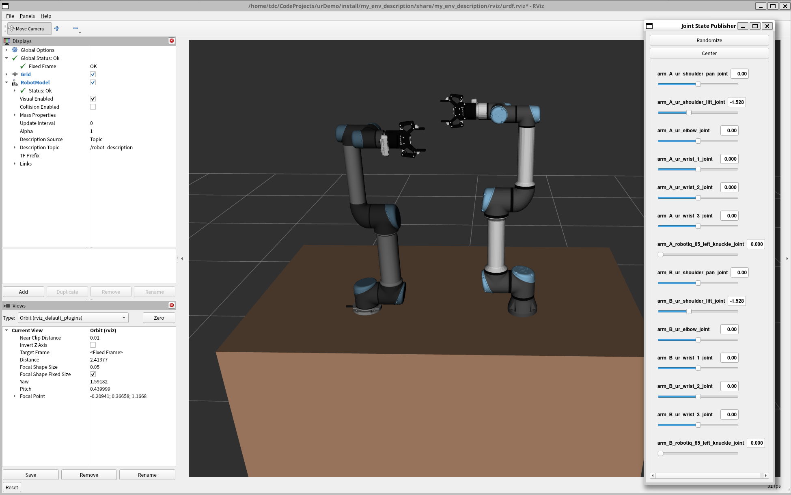

# 双臂UR机械臂ROS2控制系统

> **注意：本项目仅支持 ROS2 Jazzy 版本。**

这是一个基于ROS2的双臂UR机械臂控制系统，集成了UR5和UR5e机械臂、Robotiq 2F-85夹爪和RealSense D435相机，目前支持rviz仿真和Mujoco仿真。




## 开始

ROS2 换清华源: [清华大学开源软件镜像站 ROS2 软件仓库](https://mirror.tuna.tsinghua.edu.cn/help/ros2/)


安装依赖：

```bash
git clone https://github.com/TDC-TangChaoBanLi/Dual_UR_Demo.git
cd Dual_UR_Demo
git submodule update --init --recursive

sudo apt install ros-${ROS_DISTRO}-ros2-control ros-${ROS_DISTRO}-ros2-controllers -y
sudo apt install ros-${ROS_DISTRO}-moveit ros-${ROS_DISTRO}-moveit-ros-control-interface -y
sudo apt-get install ros-${ROS_DISTRO}-ur -y
sudo apt install ros-${ROS_DISTRO}-librealsense2* -y
sudo apt install ros-${ROS_DISTRO}-realsense2-* -y
```

测试： (robot_ip 为机械臂IP地址, reverse_ip 为本机地址)

```bash
ros2 launch ur_robot_driver ur_control.launch.py ur_type:=ur5 robot_ip:=192.168.1.17 reverse_ip:=192.168.1.100
ros2 launch ur_robot_driver ur_control.launch.py ur_type:=ur5e robot_ip:=192.168.1.11 reverse_ip:=192.168.1.100
```

编译本项目：

```bash
sudo apt install colcon -y
colcon build --symlink-install --packages-select robotiq_driver robotiq_controllers robotiq_description
colcon build --symlink-install --packages-select my_env_description my_env_moveit_config my_env_control
```

提取机械臂校准文件：

```bash
ros2 launch ur_calibration calibration_correction.launch.py robot_ip:=192.168.1.17 target_filename:="src/my_env/my_env_control/config/ur_A_kinematics_calibration.yaml"
ros2 launch ur_calibration calibration_correction.launch.py robot_ip:=192.168.1.11 target_filename:="src/my_env/my_env_control/config/ur_B_kinematics_calibration.yaml"
```

启动机械臂：

```bash
ros2 launch my_env_control start_my_env_control.launch.py activate_gripper_controller:=false use_fake_hardware:=false ur_headless_mode:=true launch_rviz:=false
```

配置 MoveIt :

```bash
ros2 launch moveit_setup_assistant setup_assistant.launch.py
```


启动 MoveIt ：


```bash
ros2 launch my_env_control start_my_env_control.launch.py activate_gripper_controller:=false launch_rviz:=false
ros2 launch my_env_moveit_config start_my_env_moveit.launch.py
```


dashboard_client 服务
```bash
# 启停相关
ros2 service call /arm_A/dashboard_client/power_on std_srvs/srv/Trigger {} # 给机器人电机上电，上电后还需要释放刹车
ros2 service call /arm_A/dashboard_client/brake_release std_srvs/srv/Trigger {} # 释放刹车
ros2 service call /arm_A/dashboard_client/power_off std_srvs/srv/Trigger {}  # 关闭机器人电机
ros2 service call /arm_A/dashboard_client/shutdown std_srvs/srv/Trigger {} # 关闭机器人控制柜

ros2 service call /arm_B/dashboard_client/power_on std_srvs/srv/Trigger {} # 给机器人电机上电，上电后还需要释放刹车
ros2 service call /arm_B/dashboard_client/brake_release std_srvs/srv/Trigger {} # 释放刹车
ros2 service call /arm_B/dashboard_client/power_off std_srvs/srv/Trigger {}  # 关闭机器人电机
ros2 service call /arm_B/dashboard_client/shutdown std_srvs/srv/Trigger {} # 关闭机器人控制柜

# 程序相关
ros2 service call /arm_A/dashboard_client/load_program ur_dashboard_msgs/srv/Load "{filename: 'TDC-ROS2.urp'}" # 加载机器人上的程序
ros2 service call /arm_A/dashboard_client/play std_srvs/srv/Trigger {} # 启动已加载的程序
ros2 service call /arm_A/dashboard_client/pause std_srvs/srv/Trigger {} # 暂停已加载的程序
ros2 service call /arm_A/dashboard_client/stop std_srvs/srv/Trigger {} # 停止已加载的程序

ros2 service call /arm_B/dashboard_client/load_program ur_dashboard_msgs/srv/Load "{filename: 'TDC-ROS2.urp'}" # 加载机器人上的程序
ros2 service call /arm_B/dashboard_client/play std_srvs/srv/Trigger {} # 启动已加载的程序
ros2 service call /arm_B/dashboard_client/pause std_srvs/srv/Trigger {} # 暂停已加载的程序
ros2 service call /arm_B/dashboard_client/stop std_srvs/srv/Trigger {} # 停止已加载的程序

# 无头模式用这个
ros2 service call /arm_A_ur_io_and_status_controller/resend_robot_program std_srvs/srv/Trigger {} # 重新发送机器人上的程序
ros2 service call /arm_B_ur_io_and_status_controller/resend_robot_program std_srvs/srv/Trigger {} # 重新发送机器人上的程序

# 状态相关
ros2 service call /arm_A/dashboard_client/get_robot_mode ur_dashboard_msgs/srv/GetRobotMode {} # 查询机器人模式，例如 POWER_OFF、IDLE、RUNNING 等
ros2 service call /arm_A/dashboard_client/get_safety_mode ur_dashboard_msgs/srv/GetSafetyMode {} # 查询安全模式
ros2 service call /arm_A/dashboard_client/program_running ur_dashboard_msgs/srv/IsProgramRunning {} # 查询当前是否有程序正在运行
ros2 service call /arm_B/dashboard_client/is_in_remote_control ur_dashboard_msgs/srv/IsInRemoteControl {} # 查询机器人是否处于 Remote Control 模式

ros2 service call /arm_B/dashboard_client/get_robot_mode ur_dashboard_msgs/srv/GetRobotMode {} # 查询机器人模式，例如 POWER_OFF、IDLE、RUNNING 等
ros2 service call /arm_B/dashboard_client/get_safety_mode ur_dashboard_msgs/srv/GetSafetyMode {} # 查询安全模式
ros2 service call /arm_B/dashboard_client/program_running ur_dashboard_msgs/srv/IsProgramRunning {} # 查询当前是否有程序正在运行
```


MoveIt Servo:

```bash
ros2 launch my_env_control start_my_env_control.launch.py launch_rviz:=false activate_gripper_controller:=false initial_ur_controller:=forward_position_controller use_fake_hardware:=false ur_headless_mode:=true  

ros2 launch my_env_moveit_config start_my_env_servo.launch.py
```

```bash
ros2 control switch_controllers --deactivate arm_A_ur_forward_position_controller --activate arm_A_ur_scaled_joint_trajectory_controller
ros2 control switch_controllers --deactivate arm_B_ur_forward_position_controller --activate arm_B_ur_scaled_joint_trajectory_controller

ros2 control switch_controllers --deactivate arm_A_ur_scaled_joint_trajectory_controller --activate arm_A_ur_forward_position_controller
ros2 control switch_controllers --deactivate arm_B_ur_scaled_joint_trajectory_controller --activate arm_B_ur_forward_position_controller

ros2 control list_controllers

ros2 service call /arm_A_servo_node/switch_command_type moveit_msgs/srv/ServoCommandType "{command_type: 2}"
ros2 service call /arm_B_servo_node/switch_command_type moveit_msgs/srv/ServoCommandType "{command_type: 2}"
```


RealSense 权限：

```bash
sudo usermod -aG video $USER # 把当前用户加入 video 组
sudo reboot # 重启
groups # 查看权限组，应该有 video
```

RealSense 启动：

```bash
lsusb -t # 查看所有USB设备，确保 uvcvideo 设备的速度大于 500 Mbps
rs-enumerate-devices -s # 查看 RealSense 相机序列号 (Serial Number)
```

```bash
# 单独启动 arm_A 相机节点
ros2 launch realsense2_camera rs_launch.py \
  serial_no:=_401522071845 \
  camera_name:=arm_A \
  enable_depth:=true \
  enable_color:=true \
  depth_module.depth_profile:=640x480x30 \
  rgb_camera.color_profile:=640x480x30 \
  align_depth.enable:=true \
  pointcloud.enable:=true \
  spatial_filter.enable:=true \
  temporal_filter.enable:=true

# 单独启动 arm_B 相机节点
ros2 launch realsense2_camera rs_launch.py \
  serial_no:=_335222076295 \
  camera_name:=arm_B \
  enable_depth:=true \
  enable_color:=true \
  depth_module.depth_profile:=640x480x30 \
  rgb_camera.color_profile:=640x480x30 \
  align_depth.enable:=true \
  pointcloud.enable:=true \
  spatial_filter.enable:=true \
  temporal_filter.enable:=true

# 启动多相机节点
ros2 launch realsense2_camera rs_multi_camera_launch.py \
  serial_no1:=_401522071845 \
  serial_no2:=_335222076295 \
  camera_name1:=arm_A \
  camera_name2:=arm_B \
  camera_namespace1:=camera \
  camera_namespace2:=camera \
  enable_depth1:=true \
  enable_depth2:=true \
  enable_color1:=true \
  enable_color2:=true \
  depth_module.depth_profile1:=640x480x30 \
  depth_module.depth_profile2:=640x480x30 \
  rgb_camera.color_profile1:=640x480x30 \
  rgb_camera.color_profile2:=640x480x30 \
  align_depth.enable1:=true \
  align_depth.enable2:=true \
  pointcloud.enable1:=false \
  pointcloud.enable2:=false \
  spatial_filter.enable1:=true \
  spatial_filter.enable2:=true \
  temporal_filter.enable1:=true \
  temporal_filter.enable2:=true
```


## 项目结构概述

本项目主要包括以下几个关键组件：

1. **机械臂描述文件** - 定义双臂系统的URDF模型
2. **ros_control控制器配置** - 实现硬件接口和控制器管理
3. **MoveIt运动规划配置** - 提供高级运动规划功能
4. **Mujoco仿真配置** - 支持在Mujoco仿真环境中运行

---

## 1. 机械臂描述文件系统

### 创建的文件及其作用

| 文件路径 | 作用 |
|---------|------|
| `my_env_description/urdf/my_ur_macro.urdf.xacro` | 定义单臂系统(UR+夹爪+相机)的Xacro宏 |
| `my_env_description/urdf/my_env_macro.urdf.xacro` | 定义双臂环境(含桌子、安装座等)的Xacro宏 |
| `my_env_description/urdf/my_env.urdf.xacro` | 主描述文件，整合所有组件并暴露参数接口 |
| `my_env_description/launch/view_my_env.launch.py` | 可视化查看机器人模型的启动文件 |

### 工作原理

通过Xacro宏定义实现了模块化的机器人描述:
- 单臂模块(`my_arm`)集成了UR机械臂、Robotiq夹爪和RealSense相机
- 环境模块(`my_env`)定义了共享工作台和双臂安装位置
- 使用tf_prefix区分左右臂的坐标变换

### 启动查看

```bash
ros2 launch my_env_description view_my_env.launch.py
```

---

## 2. ros_control控制器系统

### 创建的文件及其作用

| 文件路径 | 作用 |
|---------|------|
| `my_env_control/urdf/my_env_control.urdf.xacro` | 控制专用的机器人描述文件，启用了ros2_control |
| `my_env_control/launch/my_ur_control.launch.py` | 修改版UR控制器启动文件，支持命名空间隔离 |
| `my_env_control/config/my_ur_controllers.yaml` | UR控制器配置文件，支持相对路径引用 |
| `my_env_control/urdf/robotiq_2f_85_gripper_control.urdf.xacro` | 夹爪控制专用描述文件 |
| `my_env_control/launch/my_robotiq_control.launch.py` | 夹爪控制器启动文件 |
| `my_env_control/config/my_robotiq_controllers.yaml` | 夹爪控制器配置文件 |
| `my_env_control/launch/start_my_env_control.launch.py` | 总控制器启动文件，统一管理双臂系统 |

### 修改的文件及原因

1. **控制器启动文件修改**
   - 将`/controller_manager`绝对路径改为`controller_manager`相对路径
   - 移除`robot_state_publisher`和`rviz`节点，避免重复启动
   - 添加命名空间支持，实现多机械臂隔离控制

2. **控制器配置文件修改**
   - 添加`/*:`标识符支持相对路径引用
   - 为关节名称添加`$(var tf_prefix)`前缀，区分不同机械臂

### 控制示例代码

创建了`my_env_ros2_control`节点用于演示基本控制:

```cpp
// 发布关节轨迹到机械臂
auto arm_a_traj = trajectory_msgs::msg::JointTrajectory();
// 控制夹爪开合
send_goal_to_gripper(gripper_a_client_, 0.8, 50.0);
```

### 启动控制

```bash
# 启动双臂控制系统
ros2 launch my_env_control start_my_env_control.launch.py

# 启动控制示例节点
ros2 run my_env_control my_env_ros2_control
```

---

## 3. MoveIt运动规划系统

### 创建的文件及其作用

| 文件路径 | 作用 |
|---------|------|
| `my_env_moveit_config/config/*.yaml` | MoveIt各类配置文件(joint_limits, kinematics, ompl等) |
| `my_env_moveit_config/config/my_env_controlled.srdf` | 机器人语义描述文件(通过Setup Assistant生成) |
| `my_env_moveit_config/launch/my_env_moveit.launch.py` | MoveIt系统启动文件 |

### 关键配置说明

1. **规划组设置**
   - `ur_A`, `ur_B`: 分别对应左右臂
   - 使用KDL运动学求解器

2. **控制器配置**
   ```yaml
   controller_names:
     - ur_A/scaled_joint_trajectory_controller
     - robotiq_A/robotiq_gripper_controller
   ```

3. **关节限制**
   ```yaml
   joint_limits:
     arm_A_ur_shoulder_pan_joint:
       max_velocity: 1.5708
       max_acceleration: 0.7854
   ```

### 启动MoveIt

```bash
# 首先启动底层控制器
ros2 launch my_env_control start_my_env_control.launch.py launch_rviz:=false

# 然后启动MoveIt规划系统
ros2 launch my_env_moveit_config my_env_moveit.launch.py
```

---

## 使用流程

1. **查看模型**:
   ```bash
   ros2 launch my_env_description view_my_env.launch.py
   ```

2. **启动控制器**:
   ```bash
   ros2 launch my_env_control start_my_env_control.launch.py
   ```

3. **启动MoveIt**:
   ```bash
   ros2 launch my_env_moveit_config my_env_moveit.launch.py
   ```
